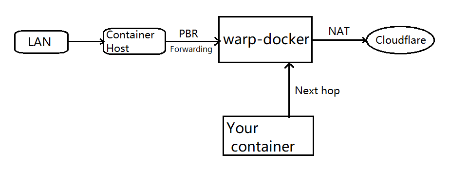

# Use warp-docker as a NAT gateway to route your traffic

Instead of using a SOCKS5 proxy, you can also route your traffic to `warp-docker`, with `WARP_ENABLE_NAT=1` and correct forwarding settings.



## Steps
- Turn on nat by set `WARP_ENABLE_NAT=1`.
    
    You will have to fix IPAM for `warp-docker`.
    
    Don't forget to toggle IPv6 on if you are using an external network that not managed by Docker compose.
    ```yaml
    # ...
    networks:
        dockernet: # The network warp-docker will use
            ipv4_address: 192.168.255.1 # fixed IPv4
            ipv6_address: fd42:4242:2189:ac:255::1 # fixed IPv6
    # ...
    networks:
    dockernet: # Sample network using external bridged network
        external: true
    ```

    Don't forget to turn IP forwarding on, via sysctl:
    ```yaml
      - net.ipv4.ip_forward=1
      - net.ipv6.conf.all.forwarding=1
      - net.ipv6.conf.all.accept_ra=2
    ```

- Make `warp-docker` the default gateway of the container that you want to browse securely.

    ```bash
    # Log in to your container from host
    docker exec -it <Container Name> /bin/bash

    # Inside your container, run:
    ip route replace default via 192.168.255.1 # fixed IPv4 of warp-docker
    ip -6 route replace default via fd42:4242:2189:ac:255::1 # fixed IPv4 of warp-docker
    ```


- With `ip rule` and/or `iptables | nftables`, you can do something magic like routing other subnets that even not on the same machine.

    ```bash
    # Create a route table called warpdocker, if not exists
    grep -q "^100 warpdocker$" /etc/iproute2/rt_tables || echo "100 warpdocker" | tee -a /etc/iproute2/rt_tables

    # add default routes for warpdocker table
    ip route add 0.0.0.0/0 via 192.168.255.1 table warpdocker
    ip -6 route add ::/0 via fd42:4242:2189:ac:255::1 table warpdocker

    # Create PBR rules
    # This will route local lan traffic to `warp-docker`
    ip rule add from 192.168.1.0/24 lookup warpdocker
    ip -6 rule add from fd42:4242:2189:cafe::/64 lookup warpdocker
    ```

    The above example will enable you to route local subnet `192.168.1.0/24` and `fd42:4242:2189:cafe::/64` using Linux PBR(Policy Based Routing) to `warp-docker` which will do NAT on your traffic.

    For non-local subnets that are not directly connected, use `iptables | nftables` to do a secondary NAT on the host. Of course with firewall rules, you can control access in your flavor.

## Sample configuration

For example, the default `docker-compose.yml` file can be changed to:

```yaml
version: "3"

services:
  warp:
    image: caomingjun/warp
    container_name: warp
    restart: always
    device_cgroup_rules:
      - 'c 10:200 rwm'
    ports:
      - "1080:1080"
    environment:
      - WARP_SLEEP=2
      - WARP_ENABLE_NAT=1 # enable nat
    cap_add:
      - MKNOD
      - AUDIT_WRITE
      - NET_ADMIN
    sysctls:
      - net.ipv6.conf.all.disable_ipv6=0
      - net.ipv4.conf.all.src_valid_mark=1
      - net.ipv4.ip_forward=1
      - net.ipv6.conf.all.forwarding=1
      - net.ipv6.conf.all.accept_ra=2
    volumes:
      - ./data:/var/lib/cloudflare-warp
    networks:
      dockernet:
        ipv4_address: 192.168.255.1
        ipv6_address: fd42:4242:2189:ac:255::1

networks:
  dockernet:
    external: true
```

After updating the `docker-compose.yml` file, run `docker-compose down && docker-compose up -d` to restart the container.
